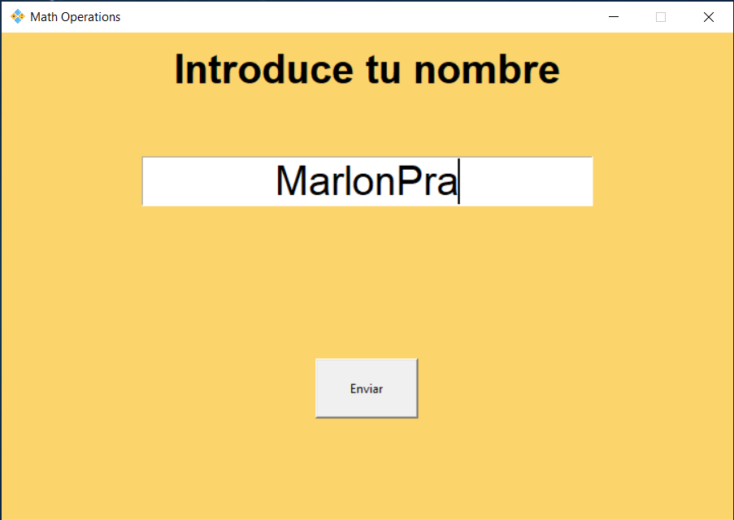
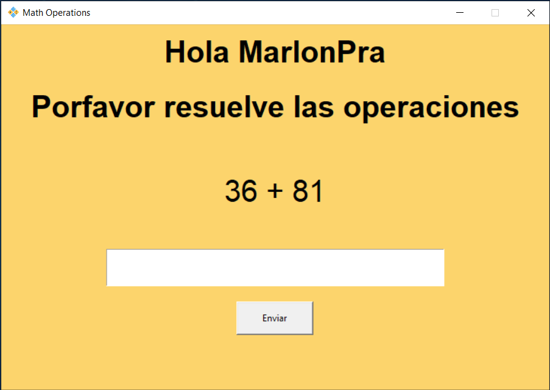
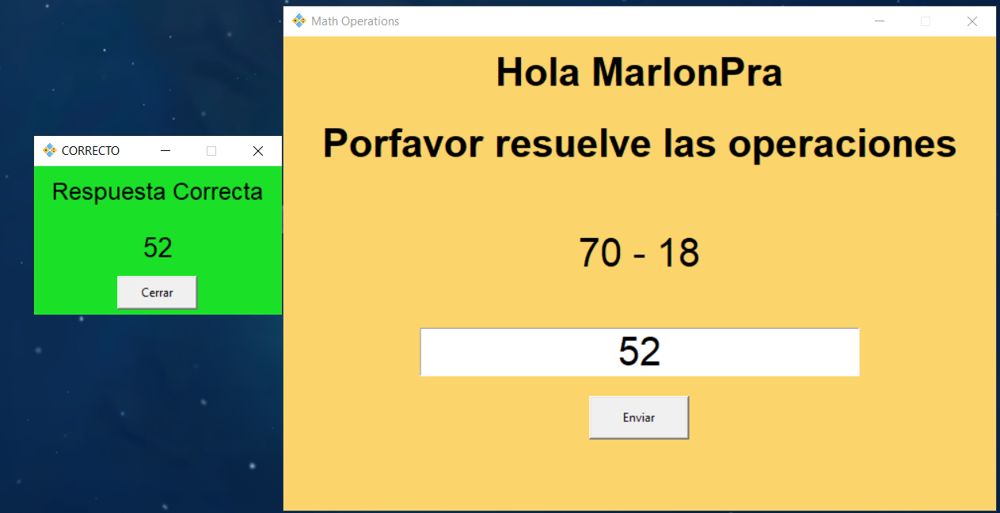
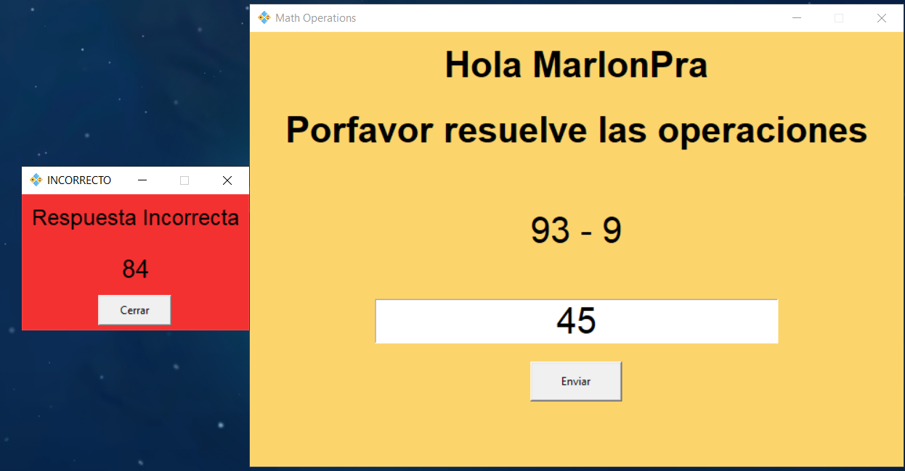

# **Operation Math (Beta)** 

   

 

------------

**Este proyecto es imprescindible para los padres que quieren que sus hijos hagan algo útil con el ordenador ejercitando su cerebro resolviendo problemas matemáticos para entrar a sus juegos favoritos.
Para descargar el programa dale click [aquí](https://github.com/MarlonPra/operations-math "Mi proyecto aca")**

------------

------------

# Dependencias

# Como Usar?
**En la parte inicial tendras que poner tú nombre para que quede registrado, despues tendras que comenzar a resolver 10 problemas matematicos para que al final te diga el resultado**

------------
# Actualziaciones Futuras

- ❌ Agregar el selector de juegos
- ❌ Bloquear el juego
- ❌ Mejorar el diseño de la aplicacion
- ❌ Agregar mas operaciones(Multiplicacion/Division)
- ❌ Dejar la Aplicacion en Segundo Plano

------------

#### Autor:
#### :shipit: **MarlonPra** :shipit:
 

