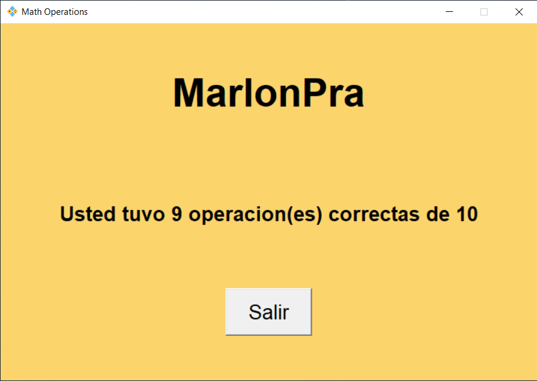
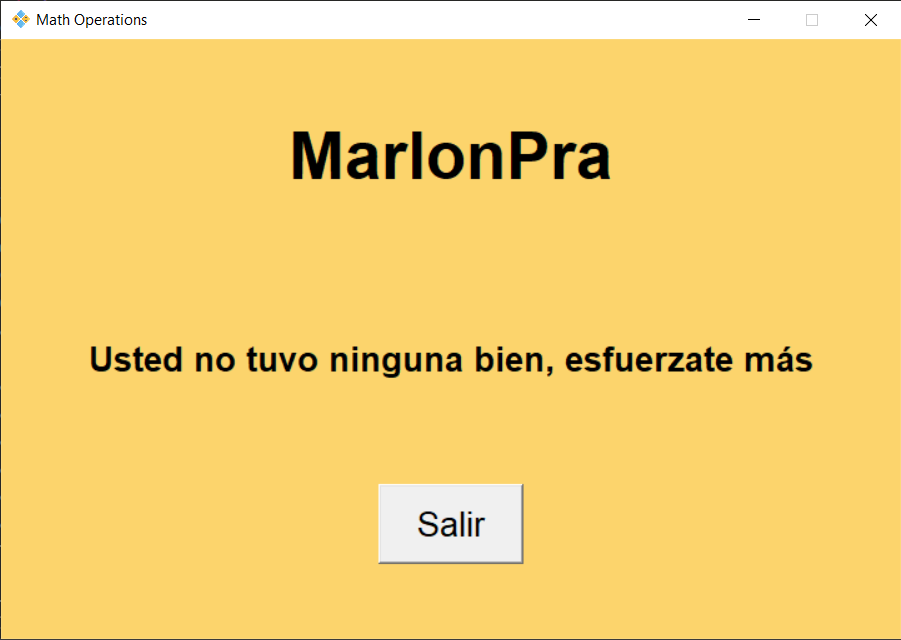

# **Operation Math (Beta)** 

  

------------

**Este proyecto es imprescindible para los padres que quieren que sus hijos hagan algo útil con el ordenador ejercitando su cerebro resolviendo problemas matemáticos para entrar a sus juegos favoritos.
Para descargar el programa dale click [aquí](https://github.com/MarlonPra/operations-math "Mi proyecto aca")**

------------

------------

# Dependencias
- [Python](https://www.python.org/downloads/) 

# ¿Como Usar?
**En la parte inicial tendras que poner tú nombre para que quede registrado, despues tendras que comenzar a resolver 10 problemas matematicos para que al final te diga el resultado**

------------

